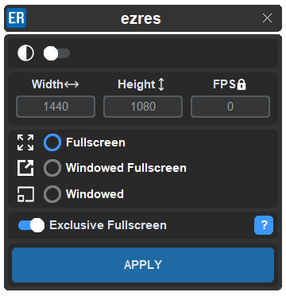
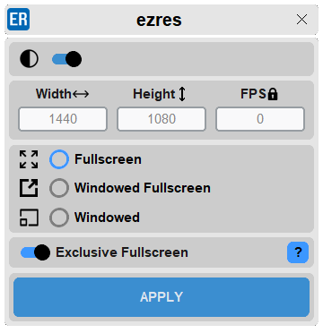

# ezres

>[!NOTE]
> - For windows desktop only **(10/11)**
> - Fortnite **needs** to be installed on your main disk

- # Preview

- # Features
  - Apply custom resolutions
  - Choose a custom FPS Lock
  - Window modes
  - Exclusive Fullscreen

# Fast installation / Update
- [Install ezres](https://github.com/ivoxprojects/ezres/releases/tag/download)
